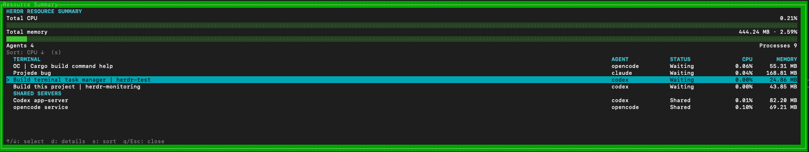
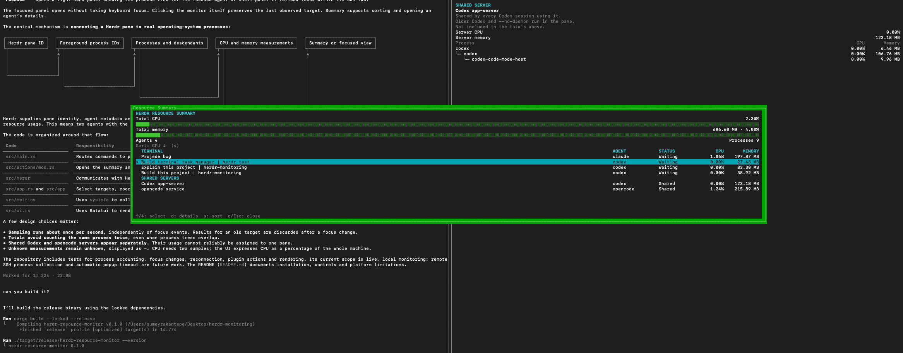
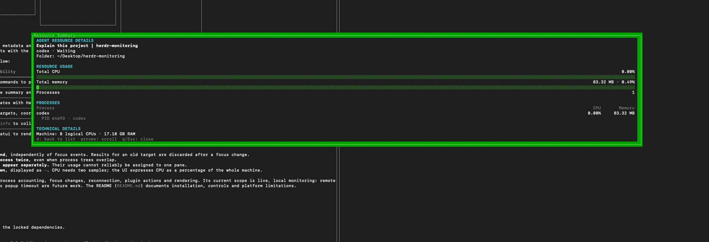
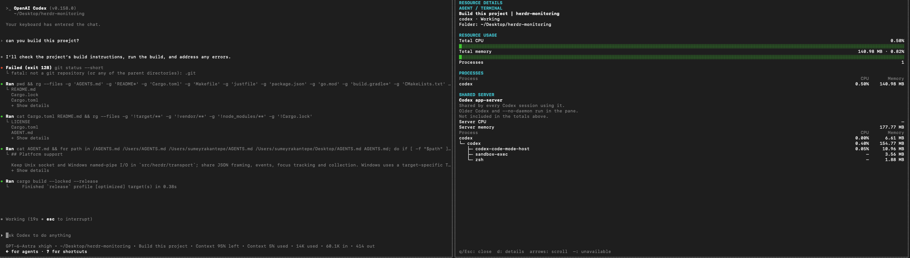
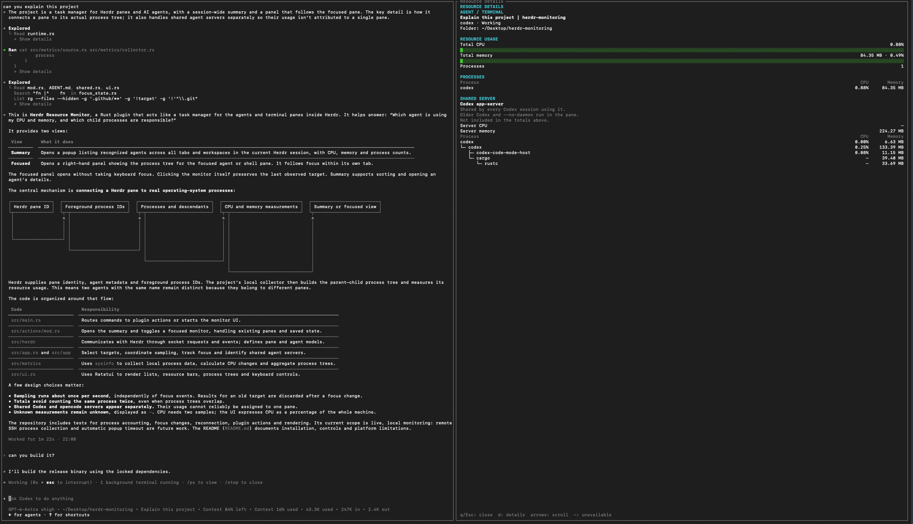
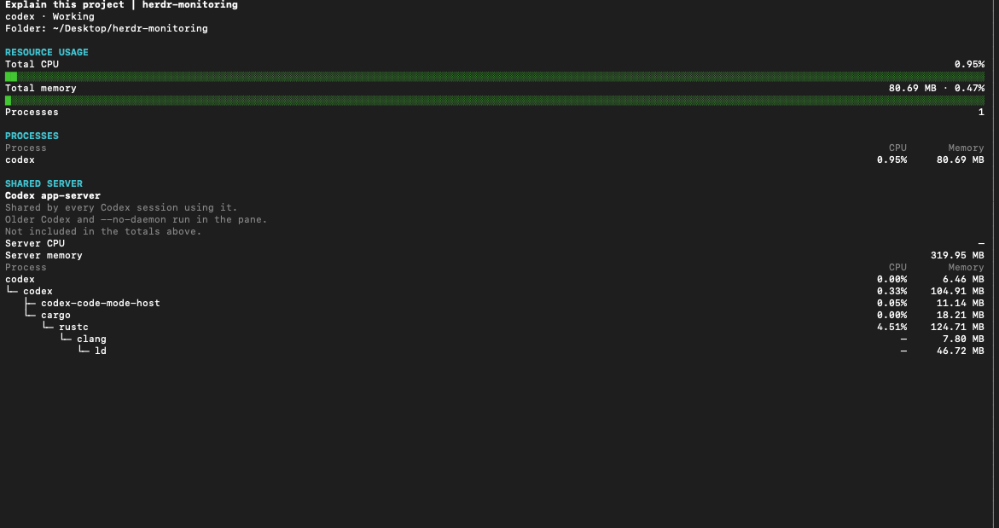

# Herdr Resource Monitor

A Rust plugin that shows the CPU, memory and process trees of agents and
terminal panes in [Herdr](https://herdr.dev). One binary provides two views:

| Mode | Herdr placement | Contents |
|---|---|---|
| `summary` | Centered popup | CPU, memory and process counts for recognized agents across the current Herdr session |
| `focused` | Persistent split on the right | Resource usage and process tree for the focused agent or shell pane in the same tab |

### Summary

Agents across the session, with shared servers listed separately:



The summary popup opened over a running Codex session:



Details of the selected agent, opened with `d`:



### Focused monitor

A Codex pane beside its monitor. The pane tree shows the TUI; the build runs in
the shared Codex server below it:





A build's compiler processes (`cargo`, `rustc`, `clang`, `ld`) under the shared
Codex server:



## Requirements

- Herdr **0.9.1 or later**, with popup support.
- Rust/Cargo **1.95 or later**, with a working native build toolchain.
- `herdr`, `cargo` and `git` on `PATH`.
- macOS, Linux or native Windows; see [platform support](#platform-support).

The plugin is built from source; there is no prebuilt binary.

## Installation

### From GitHub

```sh
herdr plugin install enes/herdr-monitoring
```

Herdr downloads the repository, runs `cargo build --locked --release` after
confirmation and registers the plugin. Append `--ref REF` to select a branch,
tag or commit. If a local checkout is linked, run
`herdr plugin unlink herdr.resource-monitor` first.

### Local checkout

```sh
git clone https://github.com/enes/herdr-monitoring.git
cd herdr-monitoring
cargo build --locked --release
herdr plugin link .
```

`plugin link` does not build; rebuild after changing the code and reopen running
monitors to load the new binary.

### Verify

```sh
herdr plugin list --plugin herdr.resource-monitor
herdr plugin action list --plugin herdr.resource-monitor
```

The plugin should be enabled, with `open-summary` and `toggle-focused` listed.
Enable it with `herdr plugin enable herdr.resource-monitor` if needed.

## Usage

Run these from a normal terminal pane, or use the [shortcuts](#suggested-shortcuts)
when an agent is using the pane.

Open the agent summary:

```sh
herdr plugin action invoke herdr.resource-monitor.open-summary
```

The popup lists recognized agents across all tabs and workspaces, sorted by CPU.
Plain shells are excluded. Below the agents, **SHARED SERVERS** lists background
servers that newer Codex and opencode versions share between sessions; see
[shared agent servers](#shared-agent-servers). Close it with `q`.

Toggle a monitor beside the current pane:

```sh
herdr plugin action invoke herdr.resource-monitor.toggle-focused
```

The split opens without taking focus and follows the focused pane in its own
tab, shells included. Focusing the monitor keeps the last target. Invoke the
action again to close it; each tab has its own monitor.

## Controls

The focused monitor opens without focus; click it before using its keys.

| Key | Summary list | Focused view or summary details |
|---|---|---|
| `q`, `Esc`, `Ctrl+C` | Close the popup | Close the monitor or popup |
| `s` | Cycle sorting: CPU → Memory → Name | — |
| `d` | Open the selected row's details | Focused: toggle technical details. Summary: back to the list. |
| `Up` / `Down` | Select a row | Scroll vertically |
| `Left` / `Right` | — | Scroll horizontally |
| `PageUp` / `PageDown` | Move a page | Scroll ten lines |
| `Home` | Select the first row | Reset scrolling |

### Reading the numbers

- **Total CPU** is a share of the whole machine: 100% means all logical cores.
- **Total memory** is resident memory (RSS) in decimal MB/GB and as a share of
  physical RAM.
- Totals include child processes; each tree row shows only its own usage.
  Summary totals count shared processes once, so they need not equal the sum of
  the rows.
- Values refresh about once per second. `—` means unknown, for example CPU
  before the second sample.
- Bars are green below 50%, yellow below 80% and red from 80%.
- `d` shows PIDs, full commands and raw metadata. Model and reasoning appear
  only when Herdr supplies them.

## Suggested shortcuts

Add to your Herdr configuration (`~/.config/herdr/config.toml`, or
`%APPDATA%\herdr\config.toml` on Windows):

```toml
[[keys.command]]
key = "prefix+shift+m"
type = "plugin_action"
command = "herdr.resource-monitor.open-summary"
description = "open resource summary"

[[keys.command]]
key = "prefix+m"
type = "plugin_action"
command = "herdr.resource-monitor.toggle-focused"
description = "toggle resource monitor"
```

Apply with `herdr server reload-config`. With the default prefix, press
**Ctrl+B**, release, then **Shift+M** or **m**.

## Shared agent servers

By default, Codex 0.158 hands each session to a background app-server daemon,
and opencode 2.x attaches to one background service. The session then runs in
that server, not in the pane, so the pane itself shows only the TUI. The monitor
shows these servers separately:

- **Summary** lists each server under **SHARED SERVERS**; `d` shows its process
  tree. Totals include servers, counting each process once.
- **Focused** shows the agent's server under **SHARED SERVER**, below the pane's
  own tree and outside the pane totals.

A server's usage covers every session using it and cannot be split between
panes. Servers are found through their own state files (`~/.codex/app-server-daemon/`
and `~/.local/state/opencode/service.json`), verified against the running process.

### What to expect

Every way of starting these agents works with the monitor. Claude always runs in
the pane; for Codex and opencode, the flags only change where a session runs, and
therefore where its usage appears.

| Started as | Session runs in | Focused view | Summary |
|---|---|---|---|
| `claude` | The pane's own `claude` process | The pane tree holds the session and the commands it runs. No shared section. | The pane row counts the session. |
| `codex` | The shared app-server daemon | The pane tree shows only the TUI. The daemon appears below under **SHARED SERVER**, outside the pane totals. | The pane row counts only the TUI. The daemon has its own row under **SHARED SERVERS**. |
| `codex --no-daemon` | The pane's own `codex` process | The pane tree holds the session. No shared section. | The pane row counts the session. |
| `opencode` | The shared background service | The pane tree shows only the TUI. The service appears below under **SHARED SERVER**, outside the pane totals. | The pane row counts only the TUI. The service has its own row under **SHARED SERVERS**. |
| `opencode --standalone` | A private server under the TUI | The pane tree holds the TUI and its `opencode serve` child. No shared section. | The pane row counts the TUI and its server. |

## Update or remove

Close running monitors first and reopen them afterwards.

- **Update from GitHub:** run the install command again.
- **Update a local checkout:** pull and run `cargo build --locked --release`.
- **Remove:** `herdr plugin uninstall herdr.resource-monitor`, or
  `herdr plugin unlink herdr.resource-monitor` for a local checkout. Remove any
  shortcuts you added.

## Troubleshooting

If nothing opens, check the plugin and its logs:

```sh
herdr plugin list --plugin herdr.resource-monitor
herdr plugin log list --plugin herdr.resource-monitor
```

A linked checkout must be built first. If a shortcut does nothing, try the
action command directly and reload the config.

| What you see | What to check |
|---|---|
| `No recognized agents` | Summary only lists agents detected by Herdr. Use focused mode for shells. |
| `No target pane` | Focus a normal terminal pane. |
| CPU shows `—` | Wait for a second sample. |
| A Codex or opencode pane shows only one process | Expected by default; see [what to expect](#what-to-expect). |
| Keys have no effect | Focus the monitor first. |
| Summary reports `ui_busy` | Another popup is open in this session, possibly in another tab. Close it first. |

## Known limitations

- The monitor should work with every agent Herdr recognizes, but it has only
  been tested with Claude, Codex and opencode. An agent that runs its sessions
  in its own shared background server may show only its TUI in the pane, since
  only the Codex and opencode servers are recognized.
- A full Herdr shutdown can close plugin panes; the monitor reconnects only
  while its process survives.
- With several attached clients, the monitor follows the latest pane focus in
  its tab.
- Only local processes are measured; SSH sessions show no remote processes.
- Memory is RSS, so shared pages can be counted more than once.

## Platform support

macOS and Linux use Unix sockets; Windows uses named pipes. Native macOS is
tested; Windows and Linux are cross-compiled and checked in CI but not yet
verified at runtime.

## Development

```sh
cargo fmt --check
cargo clippy --workspace --all-targets -- -D warnings
cargo test --workspace
```

Tests need no running Herdr server. Screens can also be run directly inside a
Herdr session:

```sh
./target/release/herdr-resource-monitor summary
./target/release/herdr-resource-monitor focused
```

## License

[MIT](LICENSE). Dependencies keep their own licenses; include their notices if
you distribute prebuilt binaries.
